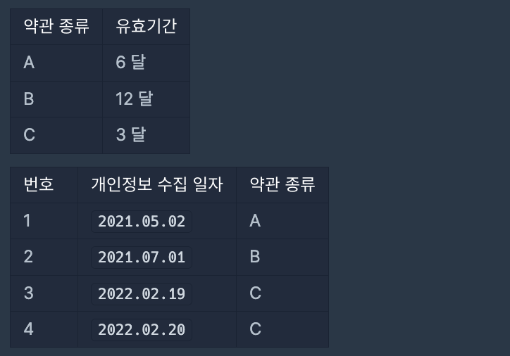

<a href="https://school.programmers.co.kr/learn/courses/30/lessons/150370#qna">개인정보 수집 유효기간</a>

고객의 약관 동의를 얻어서 수집된 1~n번으로 분류되는 개인정보 n개가 있습니다. 약관 종류는 여러 가지 있으며 각 약관마다 개인정보 보관 유효기간이 정해져 있습니다. 당신은 각 개인정보가 어떤 약관으로 수집됐는지 알고 있습니다. 수집된 개인정보는 유효기간 전까지만 보관 가능하며, 유효기간이 지났다면 반드시 파기해야 합니다.

예를 들어, A라는 약관의 유효기간이 12 달이고, 2021년 1월 5일에 수집된 개인정보가 A약관으로 수집되었다면 해당 개인정보는 2022년 1월 4일까지 보관 가능하며 2022년 1월 5일부터 파기해야 할 개인정보입니다.
당신은 오늘 날짜로 파기해야 할 개인정보 번호들을 구하려 합니다.

모든 달은 28일까지 있다고 가정합니다.

다음은 오늘 날짜가 2022.05.19일 때의 예시입니다.



- 첫 번째 개인정보는 A약관에 의해 2021년 11월 1일까지 보관 가능하며, 유효기간이 지났으므로 파기해야 할 개인정보입니다.
- 두 번째 개인정보는 B약관에 의해 2022년 6월 28일까지 보관 가능하며, 유효기간이 지나지 않았으므로 아직 보관 가능합니다.
- 세 번째 개인정보는 C약관에 의해 2022년 5월 18일까지 보관 가능하며, 유효기간이 지났으므로 파기해야 할 개인정보입니다.
- 네 번째 개인정보는 C약관에 의해 2022년 5월 19일까지 보관 가능하며, 유효기간이 지나지 않았으므로 아직 보관 가능합니다.

따라서 파기해야 할 개인정보 번호는 [1, 3]입니다.

오늘 날짜를 의미하는 문자열 today, 약관의 유효기간을 담은 1차원 문자열 배열 terms와 수집된 개인정보의 정보를 담은 1차원 문자열 배열 privacies가 매개변수로 주어집니다. 이때 파기해야 할 개인정보의 번호를 오름차순으로 1차원 정수 배열에 담아 return 하도록 solution 함수를 완성해 주세요.

### 제한사항

- today는 "YYYY.MM.DD" 형태로 오늘 날짜를 나타냅니다.
- 1 ≤ terms의 길이 ≤ 20
  - terms의 원소는 "약관 종류 유효기간" 형태의 약관 종류와 유효기간을 공백 하나로 구분한 문자열입니다.
  - 약관 종류는 A~Z중 알파벳 대문자 하나이며, terms 배열에서 약관 종류는 중복되지 않습니다.
  - <u><b>유효기간은 개인정보를 보관할 수 있는 달 수를 나타내는 정수이며, 1 이상 100 이하입니다.</b></u>
- 1 ≤ privacies의 길이 ≤ 100
  - privacies[i]는 i+1번 개인정보의 수집 일자와 약관 종류를 나타냅니다.
  - privacies의 원소는 "날짜 약관 종류" 형태의 날짜와 약관 종류를 공백 하나로 구분한 문자열입니다. 
  - 날짜는 "YYYY.MM.DD" 형태의 개인정보가 수집된 날짜를 나타내며, today 이전의 날짜만 주어집니다.
  - privacies의 약관 종류는 항상 terms에 나타난 약관 종류만 주어집니다.
- today와 privacies에 등장하는 날짜의 YYYY는 연도, MM은 월, DD는 일을 나타내며 점(.) 하나로 구분되어 있습니다.
  - 2000 ≤ YYYY ≤ 2022
  - 1 ≤ MM ≤ 12
  - MM이 한 자릿수인 경우 앞에 0이 붙습니다.
  - 1 ≤ DD ≤ 28
  - DD가 한 자릿수인 경우 앞에 0이 붙습니다.
- 파기해야 할 개인정보가 하나 이상 존재하는 입력만 주어집니다.

### 나의 풀이

- 수집 날짜의 연도, 월, 일을 숫자로 변환해서, y, m, d에 저장한다.
- 약관의 유효기간을 12로 나눈 몫을 y에 더한다.
    - 유효기간을 12로 나눴을때 몫이 0보다 크다면, 12개월 이상이므로, y에 몫을 더해준다.
- 약관의 유효기간을 12로 나눈 나머지가 있다면,
    - 만약, m+유효기간을 12로 나눈 나머지가 12보다 크면, y에 1을 더하고, m에 유효기간을 12로 나눈 나머지를 더한 값에서 12를 뺀다.
    - 만약, m+유효기간을 12로 나눈 나머지가 12보다 작으면, m에 유효기간을 12로 나눈 나머지를 더한다.
- 약관의 유효기간을 12로 나눈 나머지가 없다면, m은 변화가 없다.
- new Date로 날짜로 변환해서 오늘 날짜와 만료일을 비교한다.
- 여기서 확인해야할 부분은, 유효기간은 1 이상 100 이하의 값으로 예를 들어 25개월이라면, 2년 1개월을 보관할 수 있다는 점이다. 
    - 처음에는 수집일 월 + 유효기간만큼을 더한 `Math.floor((m+map.get(term))/12)`을 가지고, 연도를 더해주고, 월을 더해주면 된다고 생각했는데, 14, 17번 테스트 케이스가 실패했다. 그 이유는, 오늘날짜가 `2008.12.28`이고, 수집일이 `2007.11.03`, 유효기간이 13개월이면, 1년 1개월만큼을 더해줘야하는데, Math.floor(11+13)/12=2년만큼 연도를 더해주기 때문이다. (만료일이 2009년 12월 3일로, 넘어가지 않은 것으로 잘못 계산됨) 즉, 수집일의 월에 유효기간을 더한 값이 12를 넘어가면, 연도를 유효기간/12의 몫만큼 더해주고, 나머지를 월에 더해줘야한다.
- 만료일의 연도, 월, 일을 구하고, new Date()로 날짜 객체를 만드는 과정이 복잡한 것 같다. 다른 분의 풀이를 보니, 한 달은 항상 28일이라는 조건에 맞추어 일수로 통일해 계산하는 것이 훨씬 간단한 것 같다.

```js
function solution(today, terms, privacies) {
    const map = new Map(terms.map(t => {
        const [v, exp] = t.split(" ");
        return [v, Number(exp)];
    }));
    const answer = [];
    
    for(let i=0; i<privacies.length; i++) {
        const [collectionDate, term] = privacies[i].split(" ");
        let [y, m, d] = collectionDate.split(".").map(el => Number(el));
        
        y = y+Math.floor((map.get(term))/12);
        if(map.get(term)%12 > 0) {
            if(m+(map.get(term)%12) > 12) {
                y++;
                m=m+map.get(term)%12 -12
            } else {
                m=m+map.get(term)%12
            }
        }
            
        const exp = new Date(`${y}.${m}.${d}`);
        if(new Date(today) >= exp) answer.push(i+1)
    }
    return answer;
}
```

### 다른 분의 풀이 

- 훨씬 간단하고 직관적이다. 주어진 28일이라는 조건을 잘 활용한 것 같다.
- 오늘 날짜를 제한사항에 나와있는 조건(한 달을 28일로 계산)에 맞게 계산해서, 오늘 날짜를 일수로 변환한다.
- 오늘 날짜를 일수로 변환한 값과 수집일+유효기간을 일수로 변환한 값을 비교한다.

```js
function solution(today, terms, privacies) {
  var answer = [];
  var [year, month, date] = today.split(".").map(Number);
  var todates = year * 12 * 28 + month * 28 + date;
  var t = {};
  terms.forEach((e) => {
    let [a, b] = e.split(" ");
    t[a] = Number(b);
  });
  privacies.forEach((e, i) => {
    var [day, term] = e.split(" ");
    day = day.split(".").map(Number);
    var dates = day[0] * 12 * 28 + day[1] * 28 + day[2] + t[term] * 28;
    if (dates <= todates) answer.push(i + 1);
  });
  return answer;
}
```