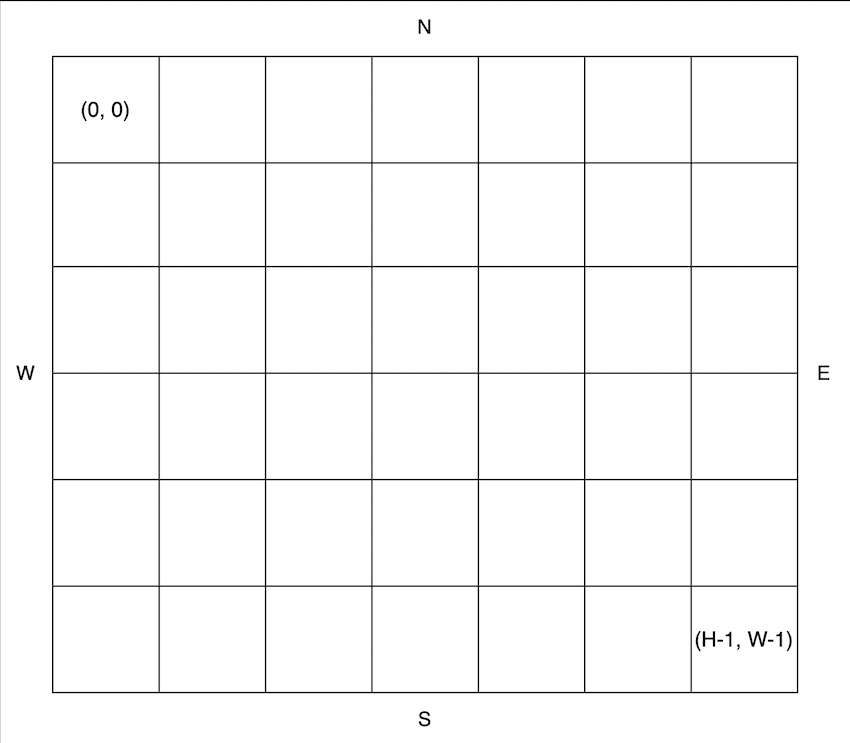

<a href="">공원 산책</a>

지나다니는 길을 'O', 장애물을 'X'로 나타낸 직사각형 격자 모양의 공원에서 로봇 강아지가 산책을 하려합니다. 산책은 로봇 강아지에 미리 입력된 명령에 따라 진행하며, 명령은 다음과 같은 형식으로 주어집니다.

["방향 거리", "방향 거리" … ]
예를 들어 "E 5"는 로봇 강아지가 현재 위치에서 동쪽으로 5칸 이동했다는 의미입니다. 로봇 강아지는 명령을 수행하기 전에 다음 두 가지를 먼저 확인합니다.

주어진 방향으로 이동할 때 공원을 벗어나는지 확인합니다.
주어진 방향으로 이동 중 장애물을 만나는지 확인합니다.
위 두 가지중 어느 하나라도 해당된다면, 로봇 강아지는 해당 명령을 무시하고 다음 명령을 수행합니다.
공원의 가로 길이가 W, 세로 길이가 H라고 할 때, 공원의 좌측 상단의 좌표는 (0, 0), 우측 하단의 좌표는 (H - 1, W - 1) 입니다.



공원을 나타내는 문자열 배열 park, 로봇 강아지가 수행할 명령이 담긴 문자열 배열 routes가 매개변수로 주어질 때, 로봇 강아지가 모든 명령을 수행 후 놓인 위치를 [세로 방향 좌표, 가로 방향 좌표] 순으로 배열에 담아 return 하도록 solution 함수를 완성해주세요.

### 제한사항

- 3 ≤ park의 길이 ≤ 50
  - 3 ≤ park[i]의 길이 ≤ 50
    - park[i]는 다음 문자들로 이루어져 있으며 시작지점은 하나만 주어집니다.
      - S : 시작 지점
      - O : 이동 가능한 통로
      - X : 장애물
  - park는 직사각형 모양입니다.

- 1 ≤ routes의 길이 ≤ 50
  - routes의 각 원소는 로봇 강아지가 수행할 명령어를 나타냅니다.
  - 로봇 강아지는 routes의 첫 번째 원소부터 순서대로 명령을 수행합니다.
  - routes의 원소는 "op n"과 같은 구조로 이루어져 있으며, op는 이동할 방향, n은 이동할 칸의 수를 의미합니다.
    - op는 다음 네 가지중 하나로 이루어져 있습니다.
      - N : 북쪽으로 주어진 칸만큼 이동합니다.
      - S : 남쪽으로 주어진 칸만큼 이동합니다.
      - W : 서쪽으로 주어진 칸만큼 이동합니다.
      - E : 동쪽으로 주어진 칸만큼 이동합니다.
    - 1 ≤ n ≤ 9

### 나의 풀이

- 첫 번째 반복문에서 시작 좌표를 찾아 start에 저장한다.
- move 함수는 방향과, 거리, 현재 좌표가 주어졌을때, 이동한 좌표를 반환한다.
- canMove 함수는 방향, 시작 좌표, 도착 좌표가 주어졌을때, 장애물을 만나지 않고 이동할 수 있는지, 그리고 도착 좌표가 범위 내에 있는지  확인한다.

```js
function solution(park, routes) {
    let start;
    let found = false;
    const widthLimit = park[0].length-1;
    const heightLimit = park.length-1;
    
    // 시작좌표 찾기
    for(let i=0; i<park.length; i++) {
        const dot = [...park[i]];
        for(let j=0; j<dot.length; j++) {
            if(dot[j] === 'S') {
                found = true;
                start = [i, j];
                break;
            }
        }
        if(found) break;
    }

    const move = (direction, distance, cur) => {
        if(direction === 'E') {
            return [cur[0], cur[1]+distance];
        }
        else if(direction === 'W') {
            return [cur[0], cur[1]-distance];
        }
        else if(direction === 'N') {
            return [cur[0]-distance, cur[1]];
        }
        return [cur[0]+distance, cur[1]];
    }
    
    const canMove = (direction, from, to) => {

        if(to[0] < 0 || to[1] > widthLimit || to[0] > heightLimit || to[1] < 0) {
            return false;
        }
        if(direction === 'S') {
            for(let i=from[0]; i<=to[0]; i++) {
                if(park[i][to[1]] === "X") return false;
            }
        }
        if(direction === 'N') {
            for(let i=from[0]; i>=to[0]; i--) {
                if(park[i][to[1]] === "X") return false;
            }
        }
        if(direction === 'E') {
            for(let i=from[1]; i<=to[1]; i++) {
                if(park[from[0]][i] === "X") return false;
            }
        }
        if(direction === 'W') {
            for(let i=from[1]; i>=to[1]; i--) {
                if(park[to[0]][i] === "X") return false;
            }
        }
        return true;
    }
    
    let result = start;

    for(const el of routes) {
        const [direction, distance] = el.split(" ");
        const cur = move(direction, Number(distance), result);
        
        if(!canMove(direction, result, cur)) continue;
        
        result = cur;
    }
    return result;
}
```

### 다른 분의 풀이 

- if 조건문을 사용해 분기를 나누는 것보다, 객체를 사용해 분기를 나누고, while 반복문을 사용해 조건을 만족할 때까지 반복하는 것이 더 깔끔하다.
- 변수명도 간결하고, 좌표를 설정할때, [x, y], [nx, ny]와 같이 표현하는 것도 좋은 것 같다.
- dirs에는 방향에 따라서 더해줄 배열을 저장해둔다.
    - E는 y좌표만 1더해주고, W는 y좌표만 1빼주고, S는 x좌표만 1더해주고, N은 x좌표만 1빼준다.
- 첫번째 반복문에서 시작 좌표를 찾는다.
- routes를 순회하면서
    - r은 방향, n은 이동할 칸의 수
    - nx, ny는 현재 좌표
    - cnt는 0으로 초기화된 이동한 칸의 수
    - cnt가 n과 같아질때까지 (즉, n번 이동했다는 의미) 반복문을 돌면서
        - 방향에 따라 nx, ny에 dirs[r]을 더해준다.
        - 만약 nx, ny가 park의 범위를 벗어나거나, 장애물을 만나면 반복문을 탈출한다. (forEach문의 다음 요소로 넘어간다.)
        - nx, ny가 범위 내에 있고, 장애물이 아니라면 cnt를 1증가시킨다. 
        - 반복문이 끝나면, cnt가 n과 같다면 [x, y]에 [nx, ny]를 할당한다. (중간에 break로 while문을 탈출했다면, [x, y]는 변화가 없다.)
    

```js
function solution(park, routes) {
        const dirs = { E: [0, 1], W: [0, -1], S: [1, 0], N: [-1, 0] };
        let [x, y] = [0, 0];
        for (let i = 0; i < park.length; i++) {
          if (park[i].includes('S')) {
            [x, y] = [i, park[i].indexOf('S')];
            break;
          }
        }

        routes.forEach((route) => {
          const [r, n] = route.split(' ');
          let [nx, ny] = [x, y];
          let cnt = 0;
          while (cnt < n) {
            [nx, ny] = [nx + dirs[r][0], ny + dirs[r][1]];
            if (!park[nx] || !park[nx][ny] || park[nx][ny] === 'X') break;
            cnt++;
          }
          if (cnt == n) [x, y] = [nx, ny];
        });
        return [x, y];
}
```