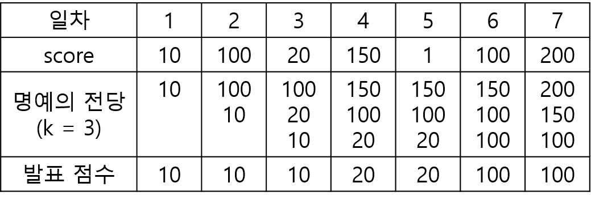

<a href="https://school.programmers.co.kr/learn/courses/30/lessons/138477">명예의 전당</a>

"명예의 전당"이라는 TV 프로그램에서는 매일 1명의 가수가 노래를 부르고, 시청자들의 문자 투표수로 가수에게 점수를 부여합니다. 매일 출연한 가수의 점수가 지금까지 출연 가수들의 점수 중 상위 k번째 이내이면 해당 가수의 점수를 명예의 전당이라는 목록에 올려 기념합니다. 즉 프로그램 시작 이후 초기에 k일까지는 모든 출연 가수의 점수가 명예의 전당에 오르게 됩니다. k일 다음부터는 출연 가수의 점수가 기존의 명예의 전당 목록의 k번째 순위의 가수 점수보다 더 높으면, 출연 가수의 점수가 명예의 전당에 오르게 되고 기존의 k번째 순위의 점수는 명예의 전당에서 내려오게 됩니다.

이 프로그램에서는 매일 "명예의 전당"의 최하위 점수를 발표합니다. 예를 들어, k = 3이고, 7일 동안 진행된 가수의 점수가 [10, 100, 20, 150, 1, 100, 200]이라면, 명예의 전당에서 발표된 점수는 아래의 그림과 같이 [10, 10, 10, 20, 20, 100, 100]입니다.



명예의 전당 목록의 점수의 개수 k, 1일부터 마지막 날까지 출연한 가수들의 점수인 score가 주어졌을 때, 매일 발표된 명예의 전당의 최하위 점수를 return하는 solution 함수를 완성해주세요.

### 제한사항

- 3 ≤ k ≤ 100
- 7 ≤ score의 길이 ≤ 1,000
  - 0 ≤ score[i] ≤ 2,000


### 나의 풀이

```js
function solution(k, score) {
    const wall = [];
    const answer = [];
    for(let i=0; i<score.length; i++) {
        wall.sort((a,b) => b-a); // 내림차순 정렬
        if(wall.length < k) {
            wall.push(score[i]);
        }
        else if(wall.length === k) {
            if(score[i] > wall[wall.length-1]) {
                wall.splice(wall.length-1, 1, score[i]);
            }
        }
        
        answer.push(Math.min(...wall));
    }
    return answer;
}
```

### 다른 분의 풀이 1

- 이 풀이는 가독성이 좋아서 쉽게 이해할 수 있었다. 하지만 배열의 길이가 길어질수록 성능이 떨어질 것 같다.
- stack은 명예의 전당에 올라가 있는 점수들을 저장한다.
- score를 reduce로 순회한다. 이때, 초기값은 빈배열로, 명예의 전당에 올라가있는 점수의 최하점을 저장한다.
    - stack의 길이가 k보다 작은 경우 
        - stack에 현재 점수를 push하고, 오름차순 정렬한다.
    - stack의 길이가 k와 같은 경우
        - stack에 현재 점수를 push하고, 오름차순 정렬한다.
        - stack의 가장 작은 점수를 shift한다.
    - a(누적 배열)에 최하점인 stack[0]을 push한다.
    - a를 반환한다.
```js
function solution(k, score) {
    const stack = []
    return score.reduce((a,c) => {
        if(stack.length < k) {
            stack.push(c)
            stack.sort((a,b) => a - b)
        }
        else {
            stack.push(c)
            stack.sort((a,b) => a - b)
            stack.shift()
        }
        a.push(stack[0])
        return a
    },[])
}
```

### 다른 분의 풀이 2

- answer는 상위 k개의 점수를 저장하는 배열(명예의 전당)이다.
- score를 reduce로 순회하고, 초기값은 빈배열로 명예의 전당의 최하점을 갱신한다.
    - answer에 현재 점수를 push한다.
    - answer를 내림차순 정렬하고 k개만큼 slice한다. (상위 k개만 answer에 저장)
    - a(누적 배열)에 answer의 최하점을 push한다.

```js
// 1. score를 돌면서 length(k)가 이하인 녀석들의 최하위 점수를 만들어 배열에 리턴하면 된다.
// 2. 단, score는 이전에 돌면서 만들었던 배열 k 갯수에 새로들어오는 score를 추가해서 k개로 다시 만들어야 한다.

function solution(k, score) {
    var answer = [];

    return score.reduce((acc, cur) => {
        answer.push(cur);
        answer = answer.sort((a, b) => b - a).slice(0, k);
        return [...acc, Math.min(...answer)];
    }, []);
}
```