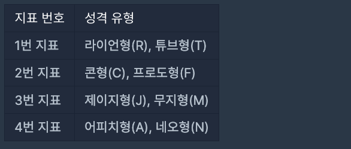
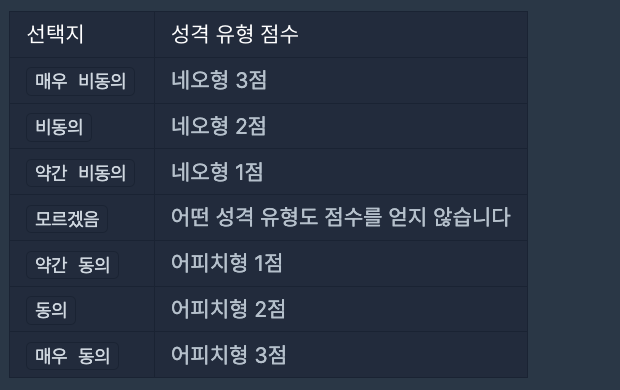
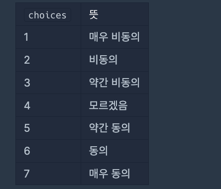

<a href="">성격 유형 검사하기</a>

나만의 카카오 성격 유형 검사지를 만들려고 합니다.
성격 유형 검사는 다음과 같은 4개 지표로 성격 유형을 구분합니다. 성격은 각 지표에서 두 유형 중 하나로 결정됩니다.


4개의 지표가 있으므로 성격 유형은 총 16(=2 x 2 x 2 x 2)가지가 나올 수 있습니다. 예를 들어, "RFMN"이나 "TCMA"와 같은 성격 유형이 있습니다.

검사지에는 총 n개의 질문이 있고, 각 질문에는 아래와 같은 7개의 선택지가 있습니다.

- 매우 비동의
- 비동의
- 약간 비동의
- 모르겠음
- 약간 동의
- 동의
- 매우 동의

각 질문은 1가지 지표로 성격 유형 점수를 판단합니다.

예를 들어, 어떤 한 질문에서 4번 지표로 아래 표처럼 점수를 매길 수 있습니다.



이때 검사자가 질문에서 약간 동의 선택지를 선택할 경우 어피치형(A) 성격 유형 1점을 받게 됩니다. 만약 검사자가 매우 비동의 선택지를 선택할 경우 네오형(N) 성격 유형 3점을 받게 됩니다.

위 예시처럼 네오형이 비동의, 어피치형이 동의인 경우만 주어지지 않고, 질문에 따라 네오형이 동의, 어피치형이 비동의인 경우도 주어질 수 있습니다.
하지만 각 선택지는 고정적인 크기의 점수를 가지고 있습니다.

매우 동의나 매우 비동의 선택지를 선택하면 3점을 얻습니다.
동의나 비동의 선택지를 선택하면 2점을 얻습니다.
약간 동의나 약간 비동의 선택지를 선택하면 1점을 얻습니다.
모르겠음 선택지를 선택하면 점수를 얻지 않습니다.
검사 결과는 모든 질문의 성격 유형 점수를 더하여 각 지표에서 더 높은 점수를 받은 성격 유형이 검사자의 성격 유형이라고 판단합니다. 단, 하나의 지표에서 각 성격 유형 점수가 같으면, 두 성격 유형 중 사전 순으로 빠른 성격 유형을 검사자의 성격 유형이라고 판단합니다.

질문마다 판단하는 지표를 담은 1차원 문자열 배열 survey와 검사자가 각 질문마다 선택한 선택지를 담은 1차원 정수 배열 choices가 매개변수로 주어집니다. 이때, 검사자의 성격 유형 검사 결과를 지표 번호 순서대로 return 하도록 solution 함수를 완성해주세요.


### 제한사항
- 1 ≤ survey의 길이 ( = n) ≤ 1,000
  - survey의 원소는 "RT", "TR", "FC", "CF", "MJ", "JM", "AN", "NA" 중 하나입니다.
  - survey[i]의 첫 번째 캐릭터는 i+1번 질문의 비동의 관련 선택지를 선택하면 받는 성격 유형을 의미합니다.
  - survey[i]의 두 번째 캐릭터는 i+1번 질문의 동의 관련 선택지를 선택하면 받는 성격 유형을 의미합니다.
- choices의 길이 = survey의 길이
  - choices[i]는 검사자가 선택한 i+1번째 질문의 선택지를 의미합니다.
  - 1 ≤ choices의 원소 ≤ 7



### 나의 풀이

```js
function solution(survey, choices) {
    const test = new Map();
    const indicator = new Map([["RT", 1], ["TR", 1], ["CF", 2], ["FC", 2], ["JM", 3], ["MJ", 3], ["AN", 4], ["NA",4]]);
    for(let el of survey) {
        test.set(indicator.get(el), {[el[0]]: 0, [el[1]]:0});
    }
        
    const calc = (s, v) => {
        if(v>=1 && v<=4) return [indicator.get(s), s[0], 4-v];
        if(v>=5 && v<=7) return [indicator.get(s), s[1], v-4];
    }
    
    for(let i=0; i<choices.length; i++) {
        const [indicator, character, point] = calc(survey[i], choices[i]);
        const scores = test.get(indicator);
        test.set(indicator, {...scores, [character] : scores[character] + point})
    }
    
    const result = [...test].sort((a,b) => a[0]-b[0]);
    
    let answer = result.reduce((acc, cur, idx) => {
        const [i, v] = cur;
        const keys = Object.keys(v);
        if(v[keys[0]] > v[keys[1]]) acc[i-1]=keys[0];
        else if(v[keys[0]] < v[keys[1]]) acc[i-1]=keys[1]
        else {
            if(keys[0] < keys[1]) acc[i-1]=keys[0]
            else {
                acc[i-1]=keys[1]
            }
        }
        return acc;
    },Array(4).fill(''));
    
    for(let i=0; i<answer.length; i++) {
        if(!answer[i]) {
            if(i === 0) answer[i] = 'R';
            if(i === 1) answer[i] = 'C';
            if(i === 2) answer[i] = 'J';
            if(i === 3) answer[i] = 'A';
        }
    }
    return answer.join('')
        
}
```

### 다른 분의 풀이 

- 제한사항에 주어진 아래의 조건에 따라 `const [disagree, agree] = survey[i]`로 구분했다.
  - survey[i]의 첫 번째 캐릭터는 i+1번 질문의 비동의 관련 선택지를 선택하면 받는 성격 유형을 의미합니다.
  - survey[i]의 두 번째 캐릭터는 i+1번 질문의 동의 관련 선택지를 선택하면 받는 성격 유형을 의미합니다.
- 마지막에 `types.map(([a, b]) => MBTI[b] > MBTI[a] ? b : a).join("")`로 각 지표에서 더 높은 점수를 받은 성격 유형을 구하고, 같은 경우, 사전 순으로 빠른 성격 유형을 구했다. (types 배열에 각 유형은 사전 순으로 정렬되어 있음)

```js
function solution(survey, choices) {
    const MBTI = {};
    const types = ["RT","CF","JM","AN"];

    types.forEach((type) =>
        type.split('').forEach((char) => MBTI[char] = 0)
    )

    choices.forEach((choice, index) => {
        const [disagree, agree] = survey[index];

        MBTI[choice > 4 ? agree : disagree] += Math.abs(choice - 4);
    });

    return types.map(([a, b]) => MBTI[b] > MBTI[a] ? b : a).join("");
}
```