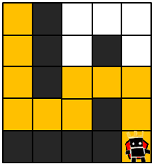
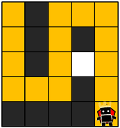
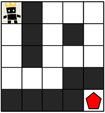

<a href="https://school.programmers.co.kr/learn/courses/30/lessons/1844">게임 맵 최단거리</a>

ROR 게임은 두 팀으로 나누어서 진행하며, 상대 팀 진영을 먼저 파괴하면 이기는 게임입니다. 따라서, 각 팀은 상대 팀 진영에 최대한 빨리 도착하는 것이 유리합니다.

지금부터 당신은 한 팀의 팀원이 되어 게임을 진행하려고 합니다. 다음은 5 x 5 크기의 맵에, 당신의 캐릭터가 (행: 1, 열: 1) 위치에 있고, 상대 팀 진영은 (행: 5, 열: 5) 위치에 있는 경우의 예시입니다.


위 그림에서 검은색 부분은 벽으로 막혀있어 갈 수 없는 길이며, 흰색 부분은 갈 수 있는 길입니다. 캐릭터가 움직일 때는 동, 서, 남, 북 방향으로 한 칸씩 이동하며, 게임 맵을 벗어난 길은 갈 수 없습니다.
아래 예시는 캐릭터가 상대 팀 진영으로 가는 두 가지 방법을 나타내고 있습니다.

- 첫 번째 방법은 11개의 칸을 지나서 상대 팀 진영에 도착했습니다.



- 두 번째 방법은 15개의 칸을 지나서 상대팀 진영에 도착했습니다.



위 예시에서는 첫 번째 방법보다 더 빠르게 상대팀 진영에 도착하는 방법은 없으므로, 이 방법이 상대 팀 진영으로 가는 가장 빠른 방법입니다.

만약, 상대 팀이 자신의 팀 진영 주위에 벽을 세워두었다면 상대 팀 진영에 도착하지 못할 수도 있습니다. 예를 들어, 다음과 같은 경우에 당신의 캐릭터는 상대 팀 진영에 도착할 수 없습니다.



게임 맵의 상태 maps가 매개변수로 주어질 때, 캐릭터가 상대 팀 진영에 도착하기 위해서 지나가야 하는 칸의 개수의 최솟값을 return 하도록 solution 함수를 완성해주세요. 단, 상대 팀 진영에 도착할 수 없을 때는 -1을 return 해주세요.

### 제한 사항

- maps는 n x m 크기의 게임 맵의 상태가 들어있는 2차원 배열로, n과 m은 각각 1 이상 100 이하의 자연수입니다.
  - n과 m은 서로 같을 수도, 다를 수도 있지만, n과 m이 모두 1인 경우는 입력으로 주어지지 않습니다.
- maps는 0과 1로만 이루어져 있으며, 0은 벽이 있는 자리, 1은 벽이 없는 자리를 나타냅니다.
- 처음에 캐릭터는 게임 맵의 좌측 상단인 (1, 1) 위치에 있으며, 상대방 진영은 게임 맵의 우측 하단인 (n, m) 위치에 있습니다.

### 참고한 풀이 

- <a href="https://yong-nyong.tistory.com/65">이 분의 풀이</a>를 보고 Queue를 구현해 풀었다.
- <b>최단거리</b>를 구하는 문제이므로 <b>BFS</b>를 사용하고, BFS는 <b>Queue</b>를 사용한다.
    - 최단거리에서 BFS를 사용하는 이유
        - BFS는 시작점으로부터 가까운 정점부터 우선적으로 탐색하므로, 최단거리를 먼저 찾을 수 있다.
        - BFS는 큐를 사용하여 구현되기 때문에, 탐색 중에 발견된 정점들을 순서대로 큐에 넣어 처리한다. 이러한 큐의 특성은 가장 먼저 발견된 경로가 최단거리 경로임을 보장한다.
- Queue를 구현할 때, 배열을 사용하지 않고 객체를 사용해 enqueue, dequeue시 시간복잡도가 O(1)이 되도록 했고, headIdx와 tailIdx를 사용한다.
    - headIdx는 dequeue할 때 사용하고, tailIdx는 enqueue할 때 사용한다.
    - headIdx와 tailIdx의 차이가 Queue의 크기가 된다.
  

```js
function solution(maps) {
    class Queue {
        constructor() {
            this.items = {};
            this.headIdx = 0;
            this.tailIdx = 0;
        }
        
        enqueue(item) {
            this.items[this.tailIdx] = item;
            this.tailIdx++;
        }
        
        dequeue() {
            const item = this.items[this.headIdx];
            delete this.items[this.headIdx];
            this.headIdx++;
            return item;
        }
        
        size() {
            return this.tailIdx - this.headIdx;
        }
    }
    
    const q = new Queue();
    const [n, m] = [maps.length, maps[0].length]; 
    const [targetX, targetY] = [n-1, m-1];
    const dx = [-1, 1, 0, 0]; // 상하좌우
    const dy = [0, 0, -1, 1]; // 상하좌우
    
    q.enqueue([0,0,1]); 
    
    while(q.size()>0) {
        const [x, y, cost] = q.dequeue();
        if(x === targetX && y === targetY) return cost;
        for(let i=0; i<dx.length; i++) {
            const nx = x + dx[i];
            const ny = y + dy[i];
            
            if(nx<0 || ny<0 || nx>=n || ny >= m) continue;
            if(maps[nx][ny] === 1) {
                q.enqueue([nx, ny, cost+1]);
                maps[nx][ny] = 0;                
            }
        }
    }
    return -1;
}
```

### 다른 분의 풀이 

- 같은 BFS를 사용했지만, 큐를 구현하지 않고 배열을 활용해 shift, push 메서드를 사용해 풀이함.
- direction을 2차원 배열로 선언해 상, 우, 하, 좌 순서로 탐색한다.
- direction을 순회하면서 현재 위치에서 상, 우, 하, 좌로 이동할 수 있는지 확인한다.
    - newRow와 newCol이 찾고자 하는 타겟 위치와 같다면, 현재까지의 이동 횟수에 1을 더한 값을 리턴한다.
    - newRow와 newCol이 maps 범위 내에 있고, 이동가능하다면 (maps[newRow][newCol] === 1) maps[newRow][newCol]을 0으로 바꾸어 방문한 것을 표시하고, 이동 횟수에 1을 더한 값을 큐에 넣는다.

```js
const direction = [[-1, 0], [0, 1], [1, 0], [0, -1]]; // 상, 우, 하, 좌

function BFS(startData, maps) {
  const rowLength = maps.length;
  const colLength = maps[0].length;
  let queue = [startData];
  while (queue.length > 0) {
    const [popRow, popCol, moveCount] = queue.shift();
    for (const dir of direction) {
      const newRow = popRow + dir[0];
      const newCol = popCol + dir[1];
      if (newRow === rowLength - 1 && newCol === colLength - 1) {
        return moveCount + 1; // 도착!
      } else if (newRow >= 0 && newRow < rowLength && newCol >= 0 && newCol < colLength && maps[newRow][newCol] === 1) {
        maps[newRow][newCol] = 0;
        queue.push([newRow, newCol, moveCount + 1]);
      }
    }
  }
  return -1;
}

function solution(maps) {
  return BFS([0, 0, 1], maps);
}
```